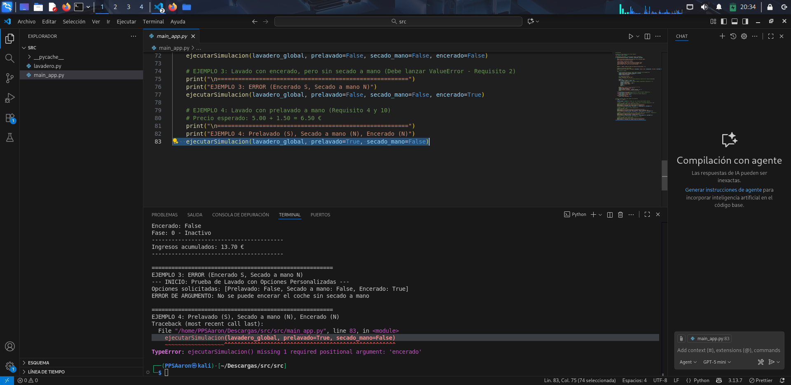
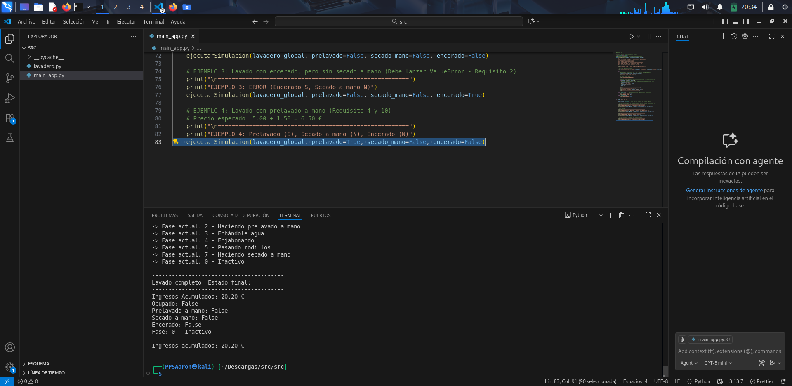

# Corrección del código y ejecución
Como se puede ver en la imagen al intentar ejecutar el código falla, ya que en la 4º ejecución solamente se le están pasando 2 parámetros al método de ```ejecutar_simulacion```, y este método necesita que se le pasen los 3 parámetros. **prelavado, secado y encerado**. 


Para solucionar el error lo único que hago es simplemente añadir el parámetro de encerado en este caso en **False**,  y como se puede ver el código ya se ejecuta correctamente. 
