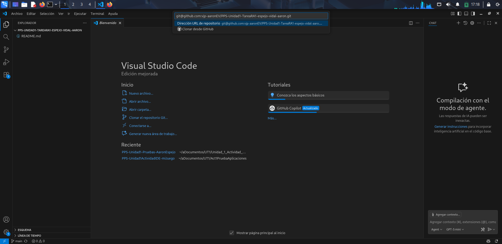

# Proceso de creación del repositorio de Github
En la página web de Github le he dado a Nuevo y he configurado el nombre, descripción y que el repositorio 
fuera público, y le he dado a 'Create repository'

Una vez hecho eso he copiado el enlace de ssh, y en VSCode he clonado el repositorio en mi kali.
