# Ejecución de las pruebas unitarias

### 1. Cuando se crea un lavadero, éste no tiene ingresos, no está ocupado, está en fase 0 y todas las opciones de lavado (prelavado a mano, secado a mano y encerado) están puestas a false.

Como se puede ver en la imagen, este test pasa correctamente por lo que no hay que corregir nada en el código. El test hace estos pasos:

- Comprueba que la fase del lavadero es inactiva
- Comprueba que los ingresos son de 0
- Comprueba que **no** está ocupado
- Y comprueba que **ninguna** de las fases esté inicializada
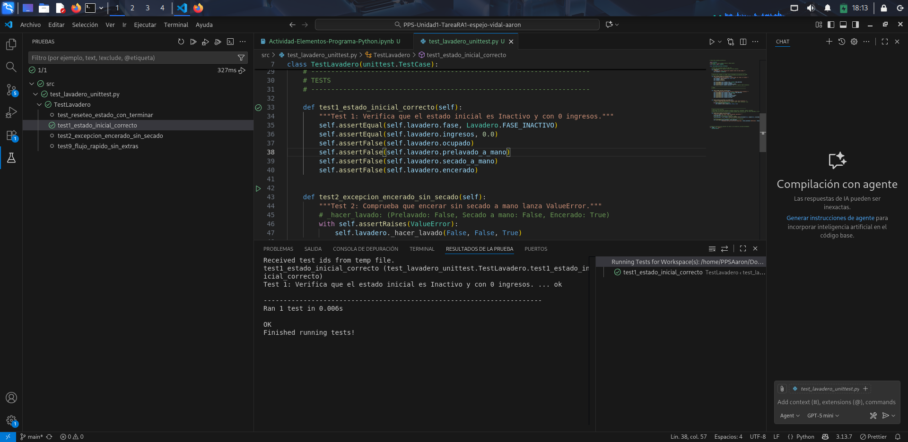

---

### 2. Cuando se intenta comprar un lavado con encerado pero sin secado a mano, se produce una ValueError.
Al igual que el test anterior pasa sin ningún error, lo que significa que la ejecución del código con las opciones asignadas da el error esperado, de nuevo estás son las fases del test:

- Ejecuta un lavado con las siguientes opciones: 
    - Prelavado: False (Sin prelavado)
    - Secado a mano: False (Sin secado a mano)
    - Encerado: True (Con encerado)
- Comprueba que la ejecución de estas opciones da como resultado el error ```ValueError```
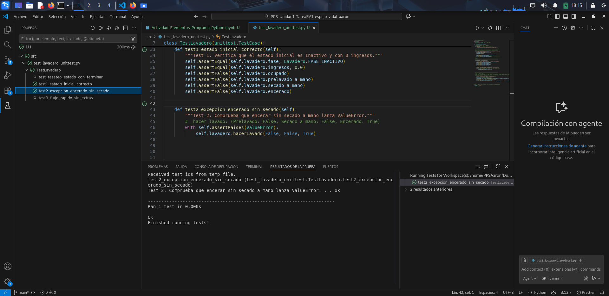

---

### 3. Cuando se intenta hacer un lavado mientras que otro ya está en marcha, se produce una ValueError.
Fases del test: 

- Inicia un lavado con cualquier configuración
- Intenta empezar otro lavado cuando se está ejecutando uno y comprueba si el error lanzado es el ```ValueError```.

En este caso el test falla, ya que nosotros estamos buscando que la ejecución produzca un error de tipo ```ValueError``` pero nos está devolviendo un error de tipo ```RuntimeError```.
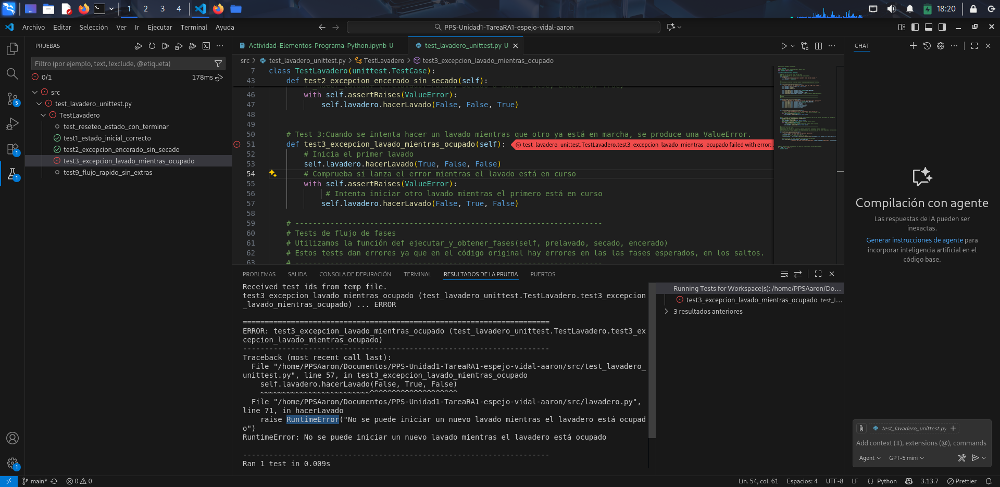
Si miramos el código, podemos ver que es porque en el código está especifcado que lance este error, para poder solcionarlo simplemente cambiamos el error ```RuntimeError``` por ```ValueError```.
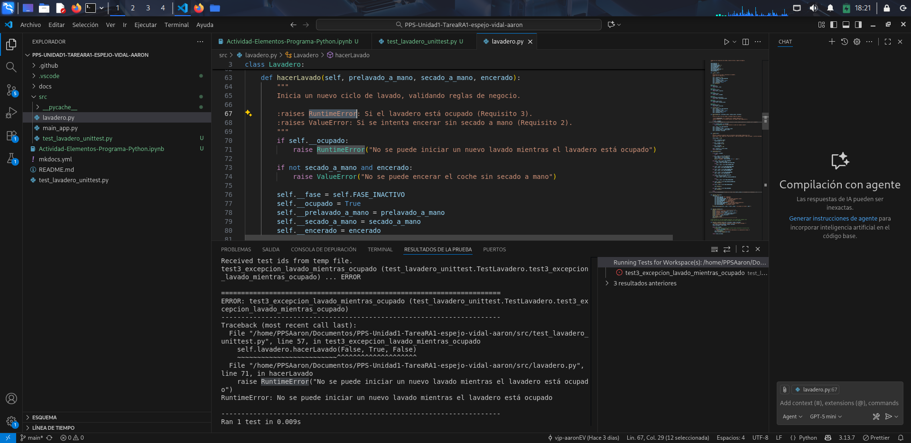

Una vez cambiado si volvemos a ejecutar la prueba ya podemos ver que ahora si lo pasa correctamente.
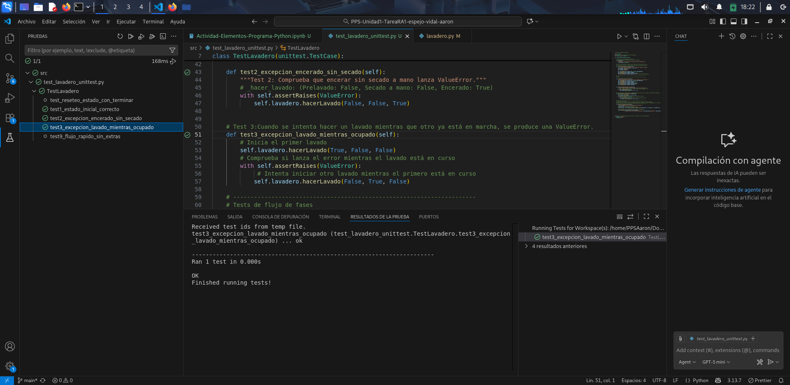

---

### 4. Si seleccionamos un lavado con prelavado a mano, los ingresos de lavadero son 6,50€.
Fases del test: 

- Inicia un lavado con las opciones:
    - Prelavado a mano: True (Con prelavado a mano)
    - Secado a mano: False (Sin secado a mano)
    - Encerado: False (Sin encerado)
- Ejecuta la función de cobrar
- Comprueba que los ingresos del lavadero son 6.50€

En este caso podemos ver que pasa el test correctamente por lo que no tendríamos que corregir nada en el código.


---

### 5. Si seleccionamos un lavado con secado a mano, los ingresos son 6,00€.
Fases del test: 

- Inicia un lavado con las opciones:
    - Prelavado a mano: False (Sin prelavado a mano)
    - Secado a mano: True (Con secado a mano)
    - Encerado: False (Sin encerado)
- Ejecuta la función de cobrar
- Comprueba que los ingresos del lavadero son 6.00€

En este caso el test falla por lo que tenemos que ir al código para ver porque está fallando.
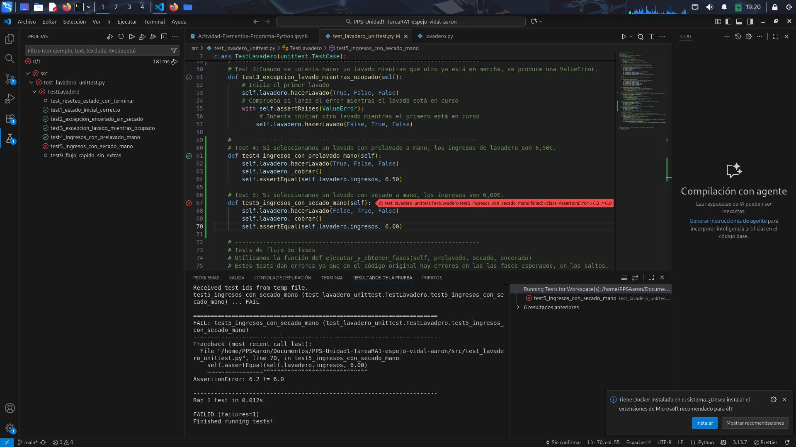
En el código podemos ver cuál es el problema, el test falla porque el coste de **secado a mano** está configurado como 1.20€ en vez de 1.00€ que sería el valor correcto.


Una vez cambiado el código podemos ver que ya pasa el test correctamente.


---

### 6. Si seleccionamos un lavado con secado a mano y encerado, los ingresos son 7,20€.
Fases del test: 

- Inicia un lavado con las opciones:
    - Prelavado a mano: False (Sin prelavado a mano)
    - Secado a mano: True (Con secado a mano)
    - Encerado: True (Con encerado)
- Ejecuta la función de cobrar
- Comprueba que los ingresos del lavadero son 7.20€

Al igual que el anterior test este también falla por lo que que tenemos que ir al código para cuál es el fallo.

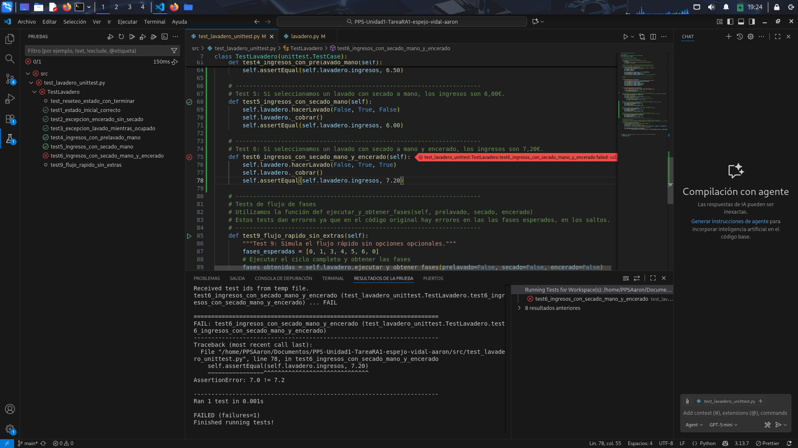
En el código podemos ver que falla porque el **coste de encerado** está asignado como 1.00€, cambiamos el valor a 1.20€ para corregir el fallo.
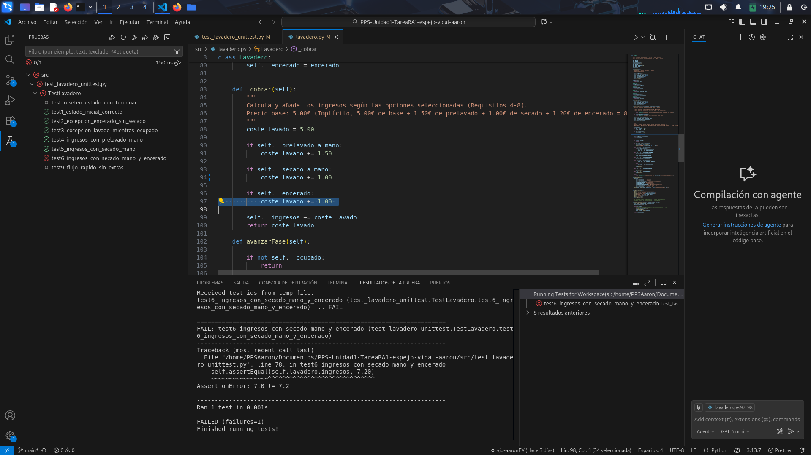

Una vez corregido el código ya podemos ver que el test pasa correctamente
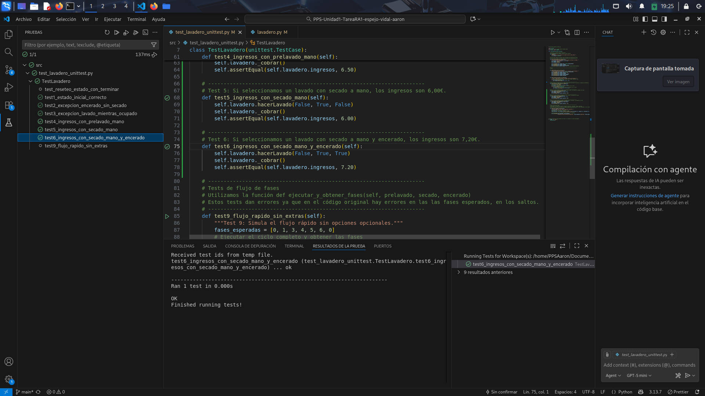

---

### 7. Si seleccionamos un lavado con prelavado a mano y secado a mano, los ingresos son 7,50€.
Fases del test:

- Inicia un lavado con las opciones:
    - Prelavado a mano: True (Con prelavado a mano)
    - Secado a mano: True (Con secado a mano)
    - Encerado: False (Sin encerado)
- Ejecuta la función de cobrar
- Comprueba que los ingresos del lavadero sean 7.50€

En este caso el test pasa correctamente por lo que no tenemos que modificar el código.


---

### 8. Si seleccionamos un lavado con prelavado a mano, secado a mano y encerado, los ingresos son 8,70€.
Fases del test:

- Inicia un lavado con las opciones:
    - Prelavado a mano: True (Con prelavado a mano)
    - Secado a mano: True (Con secado a mano)
    - Encerado: True (Con encerado)
- Ejecuta la función de cobrar
- Comprueba que los ingresos del lavadero sean 8.70€

Al igual que antes el test pasa correctamente por lo que no tenemos que modificar el código.
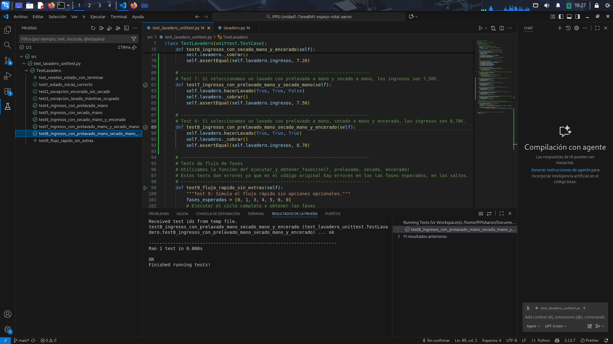

---

### 9. Si seleccionamos un lavado sin extras y vamos avanzando fases, el lavadero pasa por las fases 0, 1, 3, 4, 5, 6, 0.
Fases del test:

- Creación de un array con las fases esperadas
- Creación de un array con las fases obtenidas, se inicializa ejecutando el método de ```ejecutar_y_obtener_fases()```, con las configuraciones de lavado:
    - Prelavado a mano: False (Sin prelavado a mano)
    - Secado a mano: False (Sin secado a mano)
    - Encerado: False (Sin encerado)
Comprueba que ambos arrays son iguales, es decir, si se han ejecutado las fases correctas.

En este caso el test ha fallado ya que las fases obtenidas no son las mismas que las fases esperadas, por esto tenemos que ir al código para ver cuál es el fallo

En el código vemos que es por que la condición está al revés por lo que, en caso de que el **secado a mano** sea true, pasa a la fase de ```FASE_SECADO_AUTOMATICO```, por lo que en mi caso lo que hago es simplemente cambiar el contenido de la condición y lo intercambio.
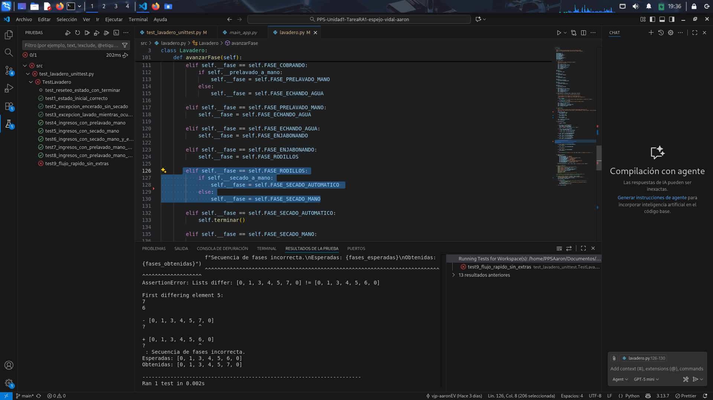

Una vez hecha la correccion cuando ejecutamos el test ya vemos que pasa correctamente.


---

### 10. Si seleccionamos un lavado con prelavado a mano y vamos avanzando fases, el lavadero pasa por las fases 0, 1, 2, 3, 4, 5, 6, 0.
Fases del test:

- Creación de un array con las fases esperadas
- Creación de un array con las fases obtenidas, se inicializa ejecutando el método de ```ejecutar_y_obtener_fases()```, con las configuraciones de lavado:
    - Prelavado a mano: True (Con prelavado a mano)
    - Secado a mano: False (Sin secado a mano)
    - Encerado: False (Sin encerado)
Comprueba que ambos arrays son iguales, es decir, si se han ejecutado las fases correctas.

En este caso si que pasa el test correctamente por lo que podemos pasar al siguiente test.
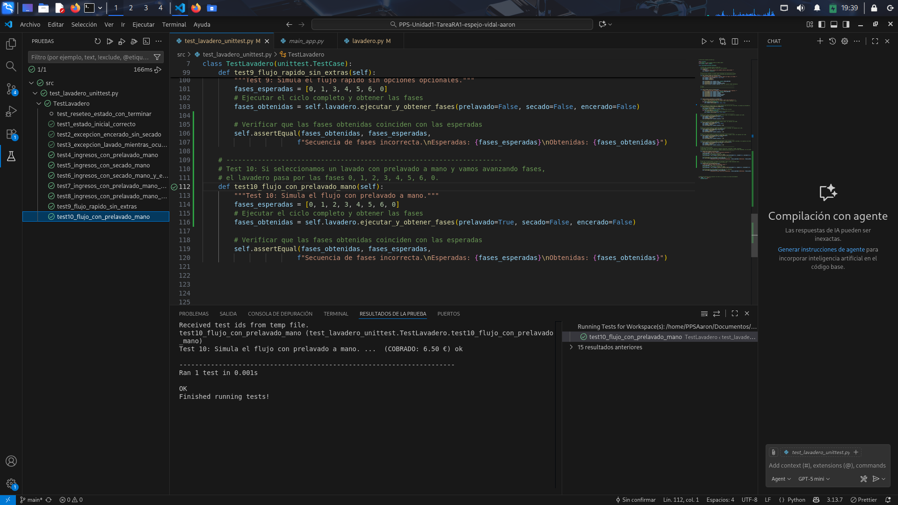

---

### 11. Si seleccionamos un lavado con secado a mano y vamos avanzando fases, el lavadero pasa por las fases 0, 1, 3, 4, 5, 7, 0.
Fases del test:

- Creación de un array con las fases esperadas
- Creación de un array con las fases obtenidas, se inicializa ejecutando el método de ```ejecutar_y_obtener_fases()```, con las configuraciones de lavado:
    - Prelavado a mano: False (Sin prelavado a mano)
    - Secado a mano: True (Con secado a mano)
    - Encerado: False (Sin encerado)
Comprueba que ambos arrays son iguales, es decir, si se han ejecutado las fases correctas.

En este caso también pasa el test correctamente por lo que podemos pasar al siguiente test.


### 12. Si seleccionamos un lavado con secado a mano y encerado y vamos avanzando fases, el lavadero pasa por las fases 0, 1, 3, 4, 5, 7, 8, 0.
Fases del test:

- Creación de un array con las fases esperadas
- Creación de un array con las fases obtenidas, se inicializa ejecutando el método de ```ejecutar_y_obtener_fases()```, con las configuraciones de lavado:
    - Prelavado a mano: False (Sin prelavado a mano)
    - Secado a mano: True (Con secado a mano)
    - Encerado: True (Con encerado)
Comprueba que ambos arrays son iguales, es decir, si se han ejecutado las fases correctas.

En este caso el test ha fallado ya que las fases obtenidas no son las mismas que las fases esperadas, por esto tenemos que ir al código para ver cuál es el fallo

En el código vemos que es porque al estar en la fase de ```FASE_SECADO_MANO``` no hay ninguna comprobación de si **encerado** está a true, esto genera que el lavado termine sin hacer el encerado, por lo que lo que hago es añadir la condición de si **encerado** es true, pase a la fase de encerado, en caso contrario que termine el lavado


Una vez hecha la correccion cuando ejecutamos el test ya vemos que pasa correctamente.
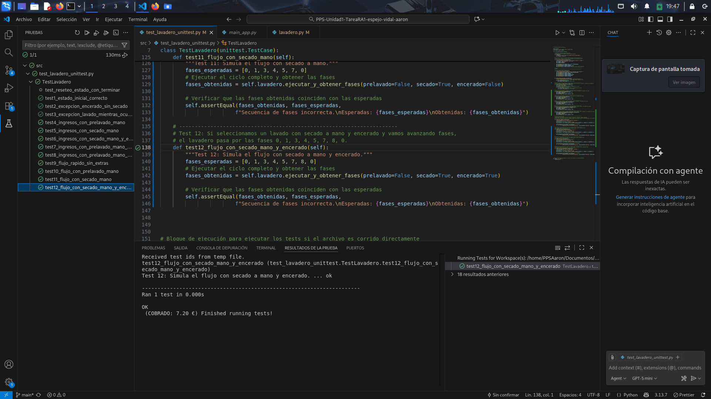

---

### 13. Si seleccionamos un lavado con prelavado a mano y secado a mano y vamos avanzando fases, el lavadero pasa por las fases 0, 1, 2, 3, 4, 5, 7, 0.
Fases del test:

- Creación de un array con las fases esperadas
- Creación de un array con las fases obtenidas, se inicializa ejecutando el método de ```ejecutar_y_obtener_fases()```, con las configuraciones de lavado:
    - Prelavado a mano: True (Con prelavado a mano)
    - Secado a mano: True (Con secado a mano)
    - Encerado: False (Sin encerado)
Comprueba que ambos arrays son iguales, es decir, si se han ejecutado las fases correctas.

En este caso pasa el test correctamente por lo que podemos pasar al siguiente test.
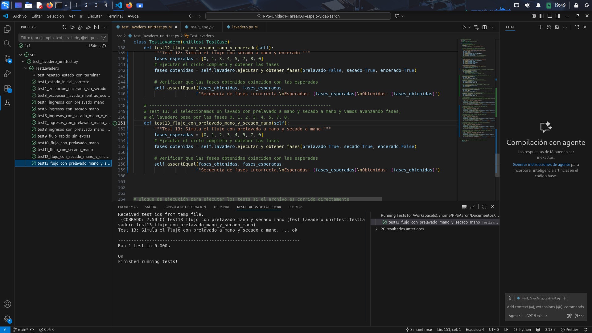

--- 

### 14. Si seleccionamos un lavado con prelavado a mano, secado a mano y encerado y vamos avanzando fases, el lavadero pasa por las fases 0, 1, 2, 3, 4, 5, 7, 8, 0.
Fases del test:

- Creación de un array con las fases esperadas
- Creación de un array con las fases obtenidas, se inicializa ejecutando el método de ```ejecutar_y_obtener_fases()```, con las configuraciones de lavado:
    - Prelavado a mano: True (Con prelavado a mano)
    - Secado a mano: True (Con secado a mano)
    - Encerado: True (Con encerado)
Comprueba que ambos arrays son iguales, es decir, si se han ejecutado las fases correctas.

En este caso pasa el test correctamente por lo que podemos pasar al siguiente test.


---

## Ejecución de todas las pruebas
Ahora ya como se puede ver todas las pruebas pasan correctamente
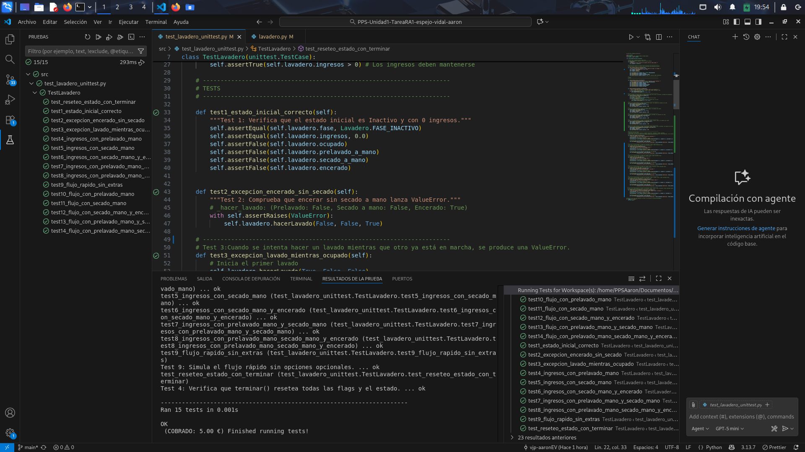