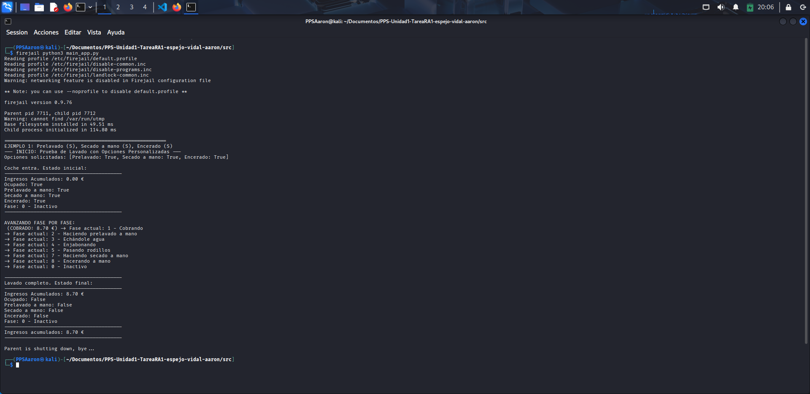

# Documentación sandbox con Firejail
Una vez hecho esto ya podemos ir a la carpeta de nuestro programa y ejecutar el main.py con firejail, para esto utilizamos el siguiente comando: ```firejail python3 main_app.py```, este comando le dice a Firejail que ejecute un entorno sandbox con python3 y ejecute el archivo ```main_app.py```.



Como se puede ver en la imágen el programa se ha ejecutado con Firejail en un sandbox, esto también lo podemos verificar con el comando ```firejail --list```, este comando nos dice los distintos entornos que se están ejecutando en Firejail.
